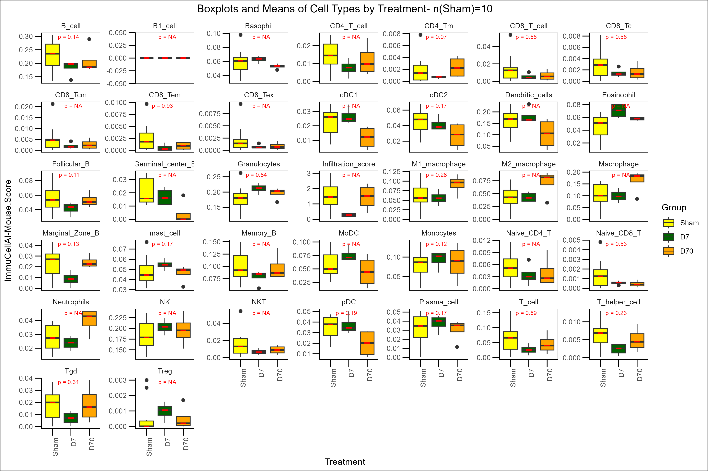

# ImmuCellAI-Mouse- Execution

This repository contains an R script that executes the ImmuCellAI-mouse tool for deconvolution of immune cell types from bulk RNA-seq data, along with visualization of the results. ImmuCellAI-mouse is designed to estimate the abundance of 36 immune cell types in mouse RNA-seq data.

**Features**

Executes ImmuCellAI-mouse to perform immune cell deconvolution.

Customizable visualization of the output.

Easy-to-modify for different datasets.

**Prerequisites**

R version 4.0 or higher

Required R packages:

`dplyr`, `GSVA`, `ImmuCellAI-mouse`, `ggplot2`, `tidyr`, `pracma`, `cowplot`

**Step by step of Execution**

 1. Clone the repository:

`git clone https://github.com/your-username/repository-name.git`

2. Prepare the Data:
  
Load your bulk RNA-seq counts data into the required format (tab delimited .txt) for ImmuCellAI-mouse.

3. Run the Script:

Make necessary modifications to the script. Example- Group/individual, etc. Execute the ImmuCellAI-mouse.R script

4. Visualize the Results:

The script generates immune cell abundance visualizations. You can customize the visualization section according to your needs.

# Sample Vizualization

# Citation 
Ya-Ru Miao, Mengxuan Xia, Mei Luo, Tao Luo, Mei Yang, An-Yuan Guo, ImmuCellAI-mouse: a tool for comprehensive prediction of mouse immune cell abundance and immune microenvironment depiction, Bioinformatics, 2021;, btab711. 
